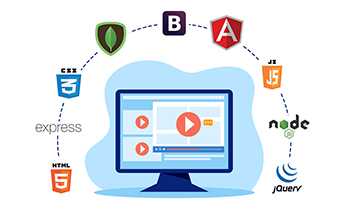

# Hola :wave:

Soy un **programador web** ubicado en la ciudad de Lerma, Estado de México. Actualmente trabajo como **Desarrollador Fullstack** en **[Figment](https://www.figment.com.mx/)**. Paralelamente imparto clases en diferentes **Bachilleratos, Universidades y Posgrados**. Además, soy el autor de la obra: **[Metodología de la Programación mediante Pseudocódigo](http://iconos.edu.mx/qrtesis/230314MV.html)**, tesis para aprender a programar a través de un Pseudolenguaje asistido por computadora.  

- 👨🏼‍💻 **JavaScript, Angular, Ionic, React, jQuery, HTML, CSS, Responsive Web Design, PHP, Laravel, Codeigniter, MySQL, MongoDB** y un poco de **NodeJS** en el lado del servidor; son la pila de herramientas que utilizo en mi día a día.
- 🏢 Como desarrollador web he trabajado en: **[Kinetiq](https://kinetiq.com.mx/)**, XPSmart México y Clínica Médica La Santa Fe. 
- 🏢 Como profesor he impartido catedra en: **[Grupo Educativo INCA](http://www.inca.edu.mx/)**, **[Centro de Bachillerato José Vasconcelos](https://www.prepajv.com/)**, e **[ICONOS](https://www.iconos.edu.mx/)**.
- 🏃‍♂️ Me apasiona el atletismo, todos los días hago un recorrido de 10km.
- 📚 Actualmente estoy enfocado en las **Single Page Applications, los Web Components, las Apps Híbridas, el Server Side Render, así como en el rendimiento, accesibilidad y optimización de páginas web**.
- 🎮 Dato curioso, me gusta jugar videojuegos de los 80's.
- 🎧 Me gusta la música, pero mis géneros favoritos son la cumbia y salsa.
- 👨🏻‍🎓 Mi objetivo a mediano plazo consiste en estudiar un Doctorado y mejorar mi Inglés.

